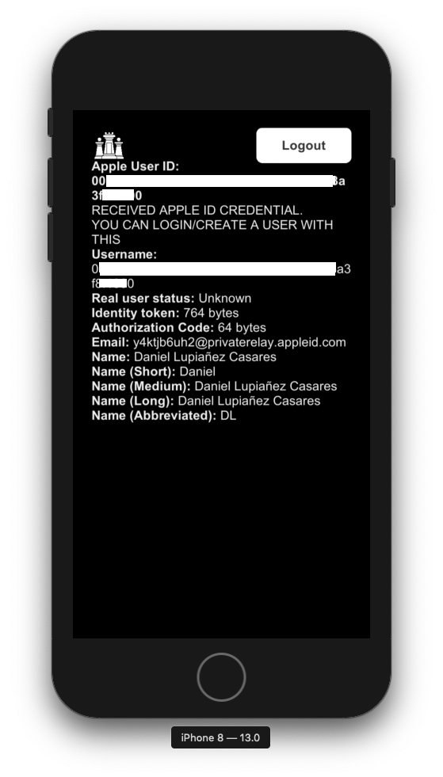
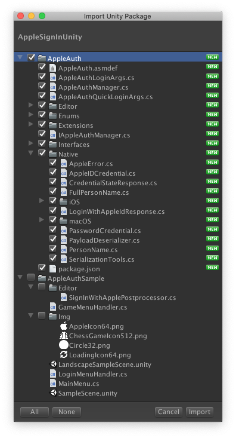

<p align="center">
  
</p>

# Sign in with Apple Unity Plugin

by **Daniel Lupiañez Casares**

[CHANGELOG](./CHANGELOG.md)


[](https://gitHub.com/lupidan/apple-signin-unity/stargazers/)
[](https://github.com/lupidan?tab=followers)
[](https://github.com/lupidan/apple-signin-unity/blob/master/LICENSE.md)

[](https://paypal.me/lupidan)
[](https://twitter.com/intent/user?screen_name=lupi_dan)


<p align="center">
    <a href="./Img/SCRN01.png"></a>
    <a href="./Img/SCRN02.png"></a>
    <a href="./Img/SCRN03.png"></a>
</p>


  * [Overview](#overview)
  * [Features](#features)
    + [Native Sign in with Apple](#native-sign-in-with-apple)
  * [Installation](#installation)
    + [Option 1: Unity Package manager](#option-1-unity-package-manager)
    + [Option 2: Unity Package file](#option-2-unity-package-file)
  * [Plugin setup (iOS/tvOS)](#plugin-setup-ios-tvos)
    + [Option 1)  Programmatic setup with a Script](#option-1--programmatic-setup-with-a-script)
    + [Option 2) Manual entitlements setup](#option-2-manual-entitlements-setup)
    + [Enabling Apple capability](#enabling-apple-capability)
    + [Final notes regarding setup](#final-notes-regarding-setup)
  * [Plugin setup (macOS)](#plugin-setup-macos)
  * [Implement Sign in With Apple](#implement-sign-in-with-apple)
    + [Initializing](#initializing)
    + [Perform Sign In With Apple](#perform-sign-in-with-apple)
    + [Quick login](#quick-login)
    + [Checking credential status](#checking-credential-status)
    + [Listening to credentials revoked notification](#listening-to-credentials-revoked-notification)
    + [Nonce support for Authorization Requests](#nonce-support-for-authorization-requests)
  * [FAQ](#faq)
    + [Does it support landscape orientations?](#does-it-support-landscape-orientations)
    + [How can I Logout? Does the plugin provide any Logout option?](#how-can-i-logout-does-the-plugin-provide-any-logout-option)
    + [I am not getting a full name, or an email, even though I am requesting them in the LoginWithAppleId call](#i-am-not-getting-a-full-name-or-an-email-even-though-i-am-requesting-them-in-the-loginwithappleid-call)
    + [Does the plugin use UnitySendMessage?](#does-the-plugin-use-unitysendmessage)
    + [Why do I need to call Update manually on the AppleAuthManager instance?](#why-do-i-need-to-call-update-manually-on-the-appleAuthManager-instance)
    + [What deserialization library does it use by default?](#what-deserialization-library-does-it-use-by-default)
    + [Any way to get a refresh token after the first user authorization?](#any-way-to-get-a-refresh-token-after-the-first-user-authorization)

## Overview
Sign in with Apple plugin to use with Unity 3D game engine.

This plugin supports the following platforms:
* **iOS**
* **macOS** ([NOTES](./docs/macOS_NOTES.md))
* **tvOS** (Experimental)

The main purpose for this plugin is to expose Apple's newest feature, Sign in with Apple, to the Unity game engine.

On WWDC19, Apple announced **Sign in with Apple**, and on top of that, they announced that every iOS/tvOS/macOS Application
that used any kind of Third party sign-ins (like *Sign in with Facebook*, or *Sign in with Google*), will have to support
Sign in with Apple in order to get approved for the App Store, making it **mandatory**.

## Features
### Native Sign in with Apple
- Support for iOS
- Support for macOS ([NOTES](./docs/macOS_NOTES.md))
- Support for tvOS (Experimental)
- Supports Sign in with Apple, with customizable scopes (Email and Full name).
- Supports Get Credential status (Authorized, Revoked and Not Found).
- Supports Quick login (including iTunes Keychain credentials).
- Supports adding Sign In with Apple capability to Xcode project programatically in a PostBuild script.
- Supports listening to Credentials Revoked notifications.
- Supports setting custom Nonce for authorization requests when Signing In, and attempting a Quick Login.

- NSError mapping so no details are missing.
- NSPersonNameComponents support (for ALL different styles).
- Customizable serialization (uses Unity default serialization, but you can add your own implementation)

## Installation

> Current stable version is v1.1.0

### Option 1: Unity Package manager

Available starting from Unity 2018.3.

Just add this line to the `Packages/manifest.json` file of your Unity Project:

```json
"dependencies": {
    "com.lupidan.apple-signin-unity": "https://github.com/lupidan/apple-signin-unity.git#v1.1.0",
}
```

If you want to use a specific [release](https://github.com/lupidan/apple-signin-unity/releases) in your code, just add `#release` at the end, like so:
```json
"dependencies": {
    "com.lupidan.apple-signin-unity": "https://github.com/lupidan/apple-signin-unity.git#v1.0.0",
}
```

### Option 2: Unity Package file
1. Download the most recent Unity package release [here](https://github.com/lupidan/apple-signin-unity/releases)
2. Import the downloaded Unity package in your app. There are two main folders:

* The `AppleAuth` folder contains the **main plugin**.
* The `AppleAuthSample` folder contains **sample code** to use as a reference, or to test the plugin.



## Plugin setup (iOS/tvOS)

To be able to use Apple's platform and framework for Authenticating with an Apple ID, we need to set up our Xcode project. Two different options are available to set up the entitlements required to enable Apple ID authentication with the iOS SDK.

### Option 1)  Programmatic setup with a Script

*RECOMMENDED*

This plugin **provides an extension method** for `ProjectCapabilityManager` ([docs](https://docs.unity3d.com/ScriptReference/iOS.Xcode.ProjectCapabilityManager.html)), used to add this entitlement programatically after an Xcode build has finished.

Simply create a Post Processing build script ([more info](https://docs.unity3d.com/ScriptReference/Callbacks.PostProcessBuildAttribute.html)) that performs the call. If you already have a post process build script, it should be simple to add to your code.

The provided extension method is `AddSignInWithApple`. No arguments are required.

Sample code:
```csharp
using AppleAuth.Editor;

public static class SignInWithApplePostprocessor
{
    [PostProcessBuild(1)]
    public static void OnPostProcessBuild(BuildTarget target, string path)
    {
        if (target != BuildTarget.iOS)
            return;

        var projectPath = PBXProject.GetPBXProjectPath(path);
        var manager = new ProjectCapabilityManager(projectPath, "Entitlements.entitlements", PBXProject.GetUnityTargetName());
        
        // Adds required Entitlements entry, and framework programatically
        manager.AddSignInWithApple();
        
        manager.WriteToFile();
    }
}
```

### Option 2) Manual entitlements setup

The other option is to manually setup all the entitlements in our Xcode project. Note that when making an iOS Build from Unity into the same folder, if you choose the option to overwrite, you will need to perform the Manual setup again.

1. In your generated Xcode project. Select your product and select the option *Signing And Capabilities*. You should see there an option to add a capability from a list. Just locate *Sign In With Apple* and add it to your project.

2. This should have added an Entitlements file to your project. Locate it on the project explorer (it should be a file with the extension `.entitlements`). Inside it you should see an entry like this one:

<p align="center">
    <a href="./Img/EntitlementsDetail.png"></a>
</p>

3. You need to import the `AuthenticationServices.framework` library in the Build Phases->Link Binary with Libraries. **If you are targeting older iOS versions**, mark the library as `Optional`

<p align="center">
    <a href="./Img/FrameworksDetail.png"></a>
</p>

### Enabling Apple capability

You will also need to **setup everything** in the Apple's developer portal. More information can be found [here](https://help.apple.com/developer-account/#/devde676e696). Please remember this plugin only supports native Sign In With Apple on iOS (no REST API support).

There is also a [Getting Started site](https://developer.apple.com/sign-in-with-apple/get-started/).

### Final notes regarding setup

The `AuthenticationServices.framework` should be added as Optional, to support previous iOS versions, avoiding crashes at startup.

The provided extension method uses reflection to integrate with the current tools Unity provides. It has been tested with Unity 2018.x and 2019.x. But if it fails on your particular Unity version, feel free to open a issue, specifying the Unity version.

## Plugin setup (macOS)

An unsigned precompiled `.bundle` file is available. It will be automatically included in your macOS builds.

The Xcode project with the source code to generate a new bundle file is available at `MacOSAppleAuthManager/MacOSAppleAuthManager.xcodeproj`

To support the feature, the app needs to be codesigned correctly, including the required entitlements. For more information regarding macOS codesign, please follow this [link](./docs/macOS_NOTES.md).

## Implement Sign in With Apple

> Currently, it seems Sign In With Apple does not work properly in the simulator. This needs testing on a device with an iOS 13 version.

An overall flow of how the native Sign In With Apple flow works is presented in this diagram.
There is no official documentation about it, the only available source for this is the WWDC 2019 talk. You can watch it [here](https://developer.apple.com/videos/play/wwdc2019/706/)


### Initializing
```csharp
private IAppleAuthManager appleAuthManager;

void Start()
{
    ...
   // If the current platform is supported
   if (AppleAuthManager.IsCurrentPlatformSupported)
   {
       // Creates a default JSON deserializer, to transform JSON Native responses to C# instances
       var deserializer = new PayloadDeserializer();
       // Creates an Apple Authentication manager with the deserializer
       this.appleAuthManager = new AppleAuthManager(deserializer);    
   }
    ...
}

void Update()
{
    ...
    // Updates the AppleAuthManager instance to execute
    // pending callbacks inside Unity's execution loop
    if (this.appleAuthManager != null)
    {
        this.appleAuthManager.Update();
    }
    ...
}
```

### Perform Sign In With Apple

If you want to Sign In and request the Email and Full Name for a user, you can do it like this:

```csharp
var loginArgs = new AppleAuthLoginArgs(LoginOptions.IncludeEmail | LoginOptions.IncludeFullName);

this.appleAuthManager.LoginWithAppleId(
    loginArgs,
    credential =>
    {
        // Obtained credential, cast it to IAppleIDCredential
        var appleIdCredential = credential as IAppleIDCredential;
        // You should save the user ID somewhere in the device
        // And now you have all the information to create/login a user in your system
        PlayerPrefs.SetString(AppleUserIdKey, credential.User);
    },
    error =>
    {
        // Something went wrong
    });
```

### Quick login

This should be the **first thing to try** when the user first runs the application.

If the user has previously authorized the app to login with Apple, this will open a native dialog to re-confirm the login, and obtain an Apple User ID.

If the credentials were never given, or they were revoked, the Quick login will fail.


```csharp
var quickLoginArgs = new AppleAuthQuickLoginArgs();

this.appleAuthManager.QuickLogin(
    quickLoginArgs,
    credential =>
    {
        // Received a valid credential!
        // Try casting to IAppleIDCredential or IPasswordCredential

        // Previous Apple sign in credential
        var appleIdCredential = credential as IAppleIDCredential; 

        // Saved Keychain credential (read about Keychain Items)
        var passwordCredential = credential as IPasswordCredential;
    },
    error =>
    {
        // Quick login failed. Go to login screen
    });
```

Note that, if this succeeds, you will **ONLY** receive the Apple User ID (no email or name, even if it was previously requested).

#### IOS Keychain Support
When performing a quick login, if the SDK detects [IOS Keychain credentials](https://developer.apple.com/documentation/security/keychain_services/keychain_items?language=objc) for your app, it will return those.

Just cast the credential to `IPasswordCredential` to get the login details for the user.

### Checking credential status

This should be the first thing to check when the user starts the app,
and there is an already logged user with an Apple user id.

Given an `userId` from a previous successful sign in.
You can check the credential state of that user ID like so:

```csharp
this.appleAuthManager.GetCredentialState(
    userId,
    state =>
    {
        switch (state)
        {
            case CredentialState.Authorized:
                // User ID is still valid. Login the user.
                break;
            
            case CredentialState.Revoked:
                // User ID was revoked. Go to login screen.
                break;
            
            case CredentialState.NotFound:
                // User ID was not found. Go to login screen.
                break;
        }
    },
    error =>
    {
        // Something went wrong
    });
```

### Listening to credentials revoked notification

It may be that your user suddenly decides to revoke the authorization that was given previously. You should be able to listen to the incoming notification by registering a callback for it.


```csharp
this.appleAuthManager.SetCredentialsRevokedCallback(result =>
{
    // Sign in with Apple Credentials were revoked.
    // Discard credentials/user id and go to login screen.
});
```

To clear the callback, and stop listening to notifications, simply set it to `null`

```csharp
this.appleAuthManager.SetCredentialsRevokedCallback(null);
```

### Nonce support for Authorization Requests

Both methods, `LoginWithAppleId` and `QuickLogin`, use a custom structure containing arguments for the authorization request.

An optional `Nonce` can be set for both structures when constructing them:

```csharp
// Your custom Nonce string
var yourCustomNonce = "YOURCUSTOMNONCEFORTHEAUTHORIZATIONREQUEST";

// Arguments for a normal Sign In With Apple Request
var loginArgs = new AppleAuthLoginArgs(
    LoginOptions.IncludeEmail | LoginOptions.IncludeFullName,
    yourCustomNonce);

// Arguments for a Quick Login
var quickLoginArgs = new AppleAuthQuickLoginArgs(yourCustomNonce);
```

This is useful for services that provide a built in solution for **Sign In With Apple**, like [Firebase](https://firebase.google.com/docs/auth/ios/apple?authuser=0)

## FAQ
+ [Does it support landscape orientations](#does-it-support-landscape-orientations)
+ [How can I Logout? Does the plugin provide any Logout option?](#how-can-i-logout-does-the-plugin-provide-any-logout-option)
+ [I am not getting a full name, or an email, even though I am requesting them in the LoginWithAppleId call](#i-am-not-getting-a-full-name-or-an-email-even-though-i-am-requesting-them-in-the-loginwithappleid-call)
+ [Does the plugin use UnitySendMessage?](#does-the-plugin-use-unitysendmessage)
+ [Why do I need to call Update manually on the AppleAuthManager instance?](#why-do-i-need-to-call-update-manually-on-the-appleAuthManager-instance)
+ [What deserialization library does it use by default?](#what-deserialization-library-does-it-use-by-default)
+ [Any way to get a refresh token after the first user authorization?](#any-way-to-get-a-refresh-token-after-the-first-user-authorization)

### Does it support landscape orientations?
On **iOS 13.0**, Apple does not support landscape orientation for this feature. For more details, check this [issue](https://github.com/lupidan/apple-signin-unity/issues/5). 

### How can I Logout? Does the plugin provide any Logout option?

On **iOS 13**  Apple does not provide any method to *"logout"* programatically. If you want to *"logout"* and re-test account creation, you need to revoke the credentials through settings.

Go to `Settings` => `Click your iTunes user` => `Password & Security` => `Apple ID logins`. There you can select the app and click on `Stop using Apple ID`.

After this, the credentials are effectively revoked, your app will receive a [Credentials Revoked notification](#listening-to-credentials-revoked-notification). This will allow you to re-test account creation.

### I am not getting a full name, or an email, even though I am requesting them in the LoginWithAppleId call

This probably means that you already used Sign In with apple at some point. Apple will give you the email/name **ONLY ONCE**. Once the credential is created, __it's your app/game's responsibility to send that information somewhere__, so an account is created with the given user identifier.

If a credential was already created, you will only receive a user identifier, so it will work similarly to a Quick Login.

If you want to test new account scenarios, you need to [revoke](#how-can-i-logout-does-the-plugin-provide-any-logout-option) your app credentials for that Apple ID through the settings menu.

### Does the plugin use UnitySendMessage?

No. The plugin uses callbacks in a static context with request identifiers using JSON strings. Callbacks are scheduled inside `AppleAuthManager`, and calling `Update` on it will execute those pending callbacks.

### Why do I need to call Update manually on the AppleAuthManager instance?

Callbacks from iOS SDK are executed in their own thread (normally the main thread), and outside Unity's engine control. Meaning that you can't update the UI, or worse, if your callback throws an Exception (like a simple NRE), it will crash the Game completely.

It's recommended to update the instance of `AppleAuthManager` regularly in a MonoBehaviour of your choice.

### What deserialization library does it use by default?

If you initialize the `AppleAuthManager` with the built-in `PayloadDeserializer`, it uses Unity JSON serialization system, so **no extra libraries are added**.

You can also implement your own deserialization by implementing an `IPayloadDeserializer`.

### Any way to get a refresh token after the first user authorization?

It seems currently is not possible to do so. You can read more details [here](https://github.com/lupidan/apple-signin-unity/issues/3)

