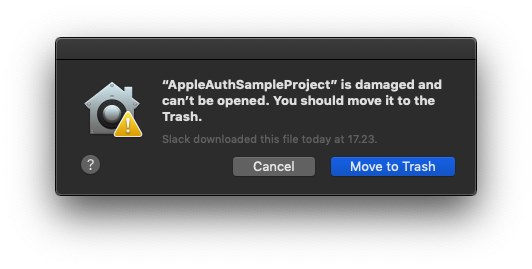

# macOS Notes

With version 1.2.0, this plugin introduces support for macOS.
This means that if your game targets macOS, **the macOS bundle will be automatically included**, and code signing it will be mandatory to get it notarized or accepted by the macOS App Store.
The bundle should be valid for both architectures Intel (x86_64) and Apple Silicon (arm64)

## Support
Sign In with Apple for macOS is only supported for apps:
- Signed with a **Developer** certificate (Apple Development or Mac Development)
- Signed with a **Distribution** certificate (Apple Distribution or Mac App Distribution)

Sign In with Apple for macOS is not supported for apps:
- Signed and Notarized with a **Developer ID** certificate

## Required entitlements
At least 3 entitlements are required for this plugin to work:

### Team identifier and application identifier 
You can find this information inside Apple developer website

```
	<key>com.apple.developer.team-identifier</key>
	<string>TEAM_IDENTIFIER</string>

	<key>com.apple.application-identifier</key>
	<string>TEAM_IDENTIFIER.APP_IDENTIFIER</string>
```

### Sign in with Apple capability
```
	<key>com.apple.developer.applesignin</key>
	<array>
		<string>Default</string>
	</array>
```

## Codesigning learnings and tips
### Remember to remove .meta files from plugin bundles
Due to a Unity bug in 2018.3, `.bundle` files exported inside the `.app` may also include `.meta` files inside it. To codesign those bundles **you will need to remove** those extraneous `.meta` files added by Unity:
```console
find MYGAME.app/Contents/Plugins/ -name "*.meta" -print0 | xargs -I {} -0 rm -v "{}"
```

### Add architecture checks for binaries
This is a step even Xcode seems to do when codesigning right before Distributing an app. Probably not necessary, but it can help detect possible issues.
```console
# If you are only targetting Intel only
lipo BINARY_PATH -verify_arch x86_64 || { echo "Intel x86_64 architecture is missing"; exit 1; }

# If you are targetting both Apple Silicon and Intel (Universal Binary)
lipo BINARY_PATH -verify_arch x86_64 || { echo "Intel x86_64 architecture is missing"; exit 1; }
lipo BINARY_PATH -verify_arch arm64 || { echo "Apple Silicon amr64 architecture is missing"; exit 1; }
```

### Remember about extended attributes
Also recommended, remove extended attributes from all the files inside the `.app`. This is specially important when distributing to other machines for testing.

For example, let's say your app is codesigned with a Developer certificate, with the correct entitlements, and including the correct Provision profile with the correct machines UUIDs.
If the codesigned app is distributed through some application, let's say, Slack or Telegram, extended attributes are added to all the files, and when attempting to run the app in the machine, you will be prompted with a message like this one 



If this is the case, just remember to remove those extended attributes using xattr
```console
xattr -crs MYGAME.app
```

### Try to avoid --deep when codesigning
According to Apple dev forums, the use of `--deep` is discouraged. Instead they recommend to codesign each element independently.

https://forums.developer.apple.com/thread/129980

### Codesign from inside-out
This one is simple, start codesigning from the deepest binaries, until you finish codesigning th main `.app` file.

### Only codesign with entitlements the main app
From my findings, you only need to codesign **with entitlements** the main `.app` file. The rest of the binaries can be just codesigned normally.

### Remember about --timestamp and --options runtime
When codesigning, remember to add a timestamp, as well as the runtime options. This is specially important to get notarized successfully!

### Don't forget about the provision profile
Specially important when codesigning with a Development certificate to distribute to other people. Remember to copy the provisionprofile file inside the .app as `embedded.provisionprofile` so the codesigned app is accepted by macOS in those machines included in it.

## A practical example
Here is a practical example on how the sample app was codesigned in order to get it to work with a development certificate. This is not 100% valid for all the cases, **each app and distribution platform has it's own requirements**.

**Step 1)** Build unsigned .app in Unity. 
 
 App file: `AppleAuthSampleProject.app`

**Step 2)** Get the name of the certificate to use. You can find this in your keychain if you generated one in your machine. In my case I want to use my Apple Developer certificate:

Certificate name: `Apple Development: My Full Name (ABCDEFGHIJ)`

**Step 3)** Find out your Team identifier, and your Application identifier. In our case:

Team ID: `ABC123DEF4`

App ID: `ABC123DEF4.com.mycompany.mygame`

**Step 4)** Prepare an entitlements file. For our case, this is the entitlements file that works:

Entitlements file: `Sign_In_With_Apple_Tests.entitlements`

```xml
<?xml version="1.0" encoding="UTF-8"?>
<!DOCTYPE plist PUBLIC "-//Apple//DTD PLIST 1.0//EN" "http://www.apple.com/DTDs/PropertyList-1.0.dtd">
<plist version="1.0">
<dict>
	<key>com.apple.security.cs.allow-jit</key>
	<true/>
	<key>com.apple.security.cs.disable-executable-page-protection</key>
	<true/>
	<key>com.apple.developer.applesignin</key>
	<array>
		<string>Default</string>
	</array>
	<key>com.apple.developer.team-identifier</key>
	<string>ABC123DEF4</string>
	<key>com.apple.application-identifier</key>
	<string>ABC123DEF4.com.mycompany.mygame</string>
</dict>
</plist>
```
 
 **Step 5)** Setup and download provision profile. Remember to enable "Sign In with Apple" for the app.
 
When downloaded, in macOS Finder quick preview (Select the file and press Space), you can see the details for that particular provision profile, like the included device IDs, the used certificate, and the used entitlements.
 
Provision profile file: `Sign_In_With_Apple_Tests_Development.provisionprofile`
 
 **Step 6)** Codesign script
 
 
 
 ```console
# Delete .meta files left by Unity in all the elements in the Plugins folder
find ./AppleAuthSampleProject.app/Contents/Plugins/ -name "*.meta" -print0 | xargs -I {} -0 rm -v "{}"

# Verify Intel architecture
lipo ./AppleAuthSampleProject.app/Contents/Frameworks/MonoBleedingEdge/MonoEmbedRuntime/osx/libMonoPosixHelper.dylib -verify_arch x86_64 || { echo "Intel x86_64 architecture is missing"; exit 1; }
lipo ./AppleAuthSampleProject.app/Contents/Frameworks/MonoBleedingEdge/MonoEmbedRuntime/osx/libmonobdwgc-2.0.dylib -verify_arch x86_64 || { echo "Intel x86_64 architecture is missing"; exit 1; }
lipo ./AppleAuthSampleProject.app/Contents/Frameworks/UnityPlayer.dylib -verify_arch x86_64 || { echo "Intel x86_64 architecture is missing"; exit 1; }
lipo ./AppleAuthSampleProject.app/Contents/Frameworks/libcrypto.dylib -verify_arch x86_64 || { echo "Intel x86_64 architecture is missing"; exit 1; }
lipo ./AppleAuthSampleProject.app/Contents/Frameworks/libssl.dylib -verify_arch x86_64 || { echo "Intel x86_64 architecture is missing"; exit 1; }
lipo ./AppleAuthSampleProject.app/Contents/Plugins/MacOSAppleAuthManager.bundle/Contents/MacOS/MacOSAppleAuthManager -verify_arch x86_64 || { echo "Intel x86_64 architecture is missing"; exit 1; }
lipo ./AppleAuthSampleProject.app/Contents/MacOS/AppleAuthSampleProject -verify_arch x86_64 || { echo "Intel x86_64 architecture is missing"; exit 1; }

# Verify Apple Silicon architecture (THIS IS ONLY REQUIRED IF YOU ARE BUILDING A UNIVERSAL BINARY)
lipo ./AppleAuthSampleProject.app/Contents/Frameworks/MonoBleedingEdge/MonoEmbedRuntime/osx/libMonoPosixHelper.dylib -verify_arch arm64 || { echo "Apple Silicon amr64 architecture is missing"; exit 1; }
lipo ./AppleAuthSampleProject.app/Contents/Frameworks/MonoBleedingEdge/MonoEmbedRuntime/osx/libmonobdwgc-2.0.dylib -verify_arch arm64 || { echo "Apple Silicon amr64 architecture is missing"; exit 1; }
lipo ./AppleAuthSampleProject.app/Contents/Frameworks/UnityPlayer.dylib -verify_arch arm64 || { echo "Apple Silicon amr64 architecture is missing"; exit 1; }
lipo ./AppleAuthSampleProject.app/Contents/Frameworks/libcrypto.dylib -verify_arch arm64 || { echo "Apple Silicon amr64 architecture is missing"; exit 1; }
lipo ./AppleAuthSampleProject.app/Contents/Frameworks/libssl.dylib -verify_arch arm64 || { echo "Apple Silicon amr64 architecture is missing"; exit 1; }
lipo ./AppleAuthSampleProject.app/Contents/Plugins/MacOSAppleAuthManager.bundle/Contents/MacOS/MacOSAppleAuthManager -verify_arch arm64 || { echo "Apple Silicon amr64 architecture is missing"; exit 1; }
lipo ./AppleAuthSampleProject.app/Contents/MacOS/AppleAuthSampleProject -verify_arch arm64 || { echo "Apple Silicon amr64 architecture is missing"; exit 1; }

# Clears extended attributes recursively
xattr -crs ./AppleAuthSampleProject.app

# Sign all the elements
# Only sign with entitlements the .app file
codesign -vvv --force --timestamp --options runtime -s "Apple Development: My Full Name (ABCDEFGHIJ)" ./AppleAuthSampleProject.app/Contents/Frameworks/MonoBleedingEdge/MonoEmbedRuntime/osx/libMonoPosixHelper.dylib
codesign -vvv --force --timestamp --options runtime -s "Apple Development: My Full Name (ABCDEFGHIJ)" ./AppleAuthSampleProject.app/Contents/Frameworks/MonoBleedingEdge/MonoEmbedRuntime/osx/libmonobdwgc-2.0.dylib
codesign -vvv --force --timestamp --options runtime -s "Apple Development: My Full Name (ABCDEFGHIJ)" ./AppleAuthSampleProject.app/Contents/Frameworks/UnityPlayer.dylib
codesign -vvv --force --timestamp --options runtime -s "Apple Development: My Full Name (ABCDEFGHIJ)" ./AppleAuthSampleProject.app/Contents/Frameworks/libcrypto.dylib
codesign -vvv --force --timestamp --options runtime -s "Apple Development: My Full Name (ABCDEFGHIJ)" ./AppleAuthSampleProject.app/Contents/Frameworks/libssl.dylib
codesign -vvv --force --timestamp --options runtime -s "Apple Development: My Full Name (ABCDEFGHIJ)" ./AppleAuthSampleProject.app/Contents/Plugins/MacOSAppleAuthManager.bundle
codesign -vvv --force --timestamp --options runtime -s "Apple Development: My Full Name (ABCDEFGHIJ)" --entitlements ./Sign_In_With_Apple_Tests.entitlements ./AppleAuthSampleProject.app

# Finally, copy provision profile
cp ./Sign_In_With_Apple_Tests_Development.provisionprofile ./AppleAuthSampleProject.app/Contents/embedded.provisionprofile

# Open the app
open ./AppleAuthSampleProject.app
 ```

 **Step 7)** [OPTIONAL] Remove extended attributes when distributing to other machines.
 
 When distributing the app to other people, macOS may add extended attributes to the files in the `.app`. Ask the receivers to clear those extended attributes by executing this line in the Terminal.
 
```console
xattr -crs ./AppleAuthSampleProject.app
 ```

## More links
Here more links regarding the wonderful world of codesigning/notarizing macOS apps:

https://forums.developer.apple.com/community/distribution/mac-app-sandbox

https://unsh.github.io/Unity-Apple-Distribution-Workflow/

https://gist.github.com/dpid/270bdb6c1011fe07211edf431b2d0fe4

https://www.strangeflavour.com/creating-mac-app-store-games-unity/
